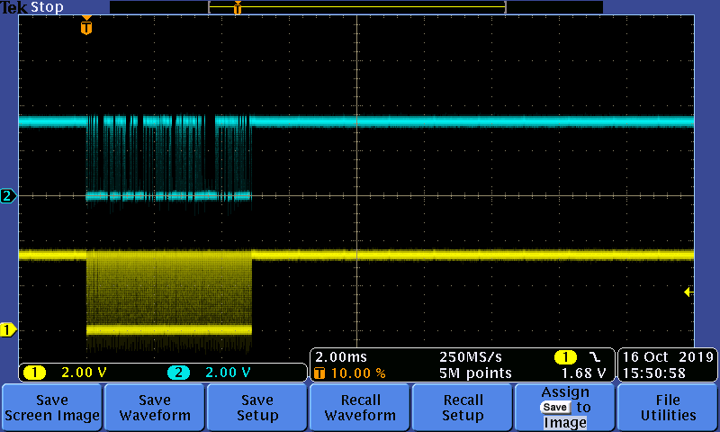
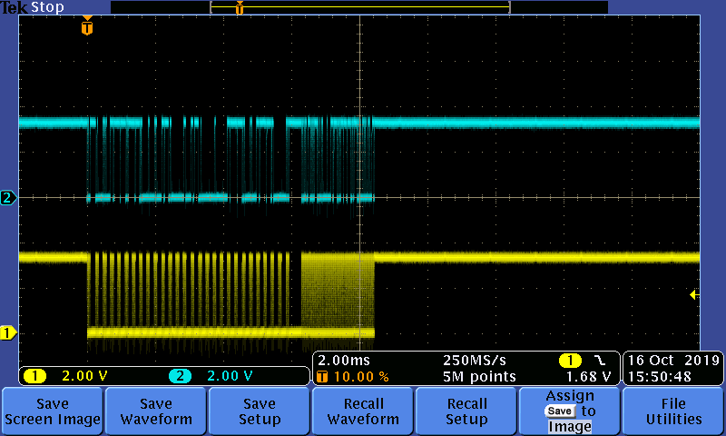
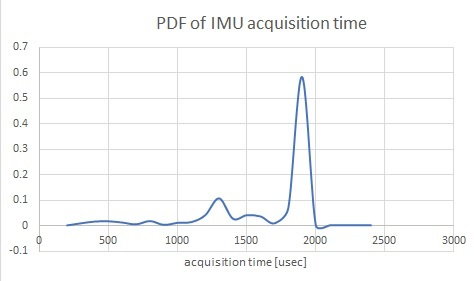

# Acquisition of the sensors over I2C


In here we report the timing results of acquisition of all the sensors IMU, ADC and skin patches using a dedicated I2C bus.  

The conclusion is that the IC2 bus @ 400Khz is able to give all the sensors' readings in a 10 ms time slot. We could even go down to 5 ms if we change some settings of the ADS122C04 chip. 


[TOC]

## Acquisition results


Here is a snapshot of the acquisition trace of all the sensors present on the I2C bus printed every 2 seconds.


```
BNO055: acc = (0.250000, -1.260000, 9.370000) m/(s*s)in S0:m1:u919
ADS122C04: (8388607, 8388607) in (S0:m3:u323, S0:m3:u325)
P02->P13 = (0 0 0 0 0 0 0 0 0 0 0 0 )in S0:m0:u774
P14->P24 = (0 0 0 0 0 0 0 0 0 0 0 10016 )in S0:m0:u775
 
BNO055: acc = (0.260000, -1.260000, 9.380000) m/(s*s)in S0:m1:u907
ADS122C04: (8388607, 8388607) in (S0:m3:u324, S0:m3:u325)
P02->P13 = (0 0 0 0 0 0 0 0 0 0 0 0 )in S0:m0:u774
P14->P24 = (0 0 0 0 0 0 0 0 0 0 0 10014 )in S0:m0:u774
 
BNO055: acc = (0.240000, -1.280000, 9.370000) m/(s*s)in S0:m1:u899
ADS122C04: (8388607, 8388607) in (S0:m3:u322, S0:m3:u325)
P02->P13 = (0 0 0 0 0 0 0 0 0 0 0 0 )in S0:m0:u775
P14->P24 = (0 0 0 0 0 0 0 0 0 0 0 10020 )in S0:m0:u774
  
BNO055: acc = (0.250000, -1.260000, 9.390000) m/(s*s)in S0:m0:u687
ADS122C04: (8388607, 8388607) in (S0:m3:u325, S0:m3:u325)
P02->P13 = (0 0 0 0 0 0 0 0 0 0 0 0 )in S0:m0:u775
P14->P24 = (0 0 0 0 0 0 0 0 0 0 0 10017 )in S0:m0:u774

BNO055: acc = (-0.110000, -0.200000, 9.430000) m/(s*s)in S0:m1:u489
ADS122C04: (8388607, 8388607) in (S0:m3:u325, S0:m3:u326)
P02->P13 = (0 5736 8608 0 3059 22356 20901 3908 9535 22084 23307 6360 )in S0:m0:u775
P14->P24 = (11284 29343 28012 0 15825 13680 0 4366 0 0 0 10815 )in S0:m0:u774
  
```

**Listing**. Trace print of the full acquisition over I2C.  


The times reported on the above listing are those measured by the application firmware and they are between the request to HW and the retrieval of the relevant data.  


If we extract a typical time print, for instance the last one, we come up with what in following table.

| Sensor            | IMU  | ADC1         | ADC2         | SKIN1 | SKIN2 | TOTAL         |
| ----------------- | ---- | ------------ | ------------ | ----- | ----- | ------------- |
| **Time [usec]**   | 1489 | 3325 (`425`) | 3326 (`426`) | 775   | 774   | 9689 (`3889`) |
| **Size in bytes** | 6    | 4            | 4            | 24    | 24    | 62            |

**Table**. Acquisition times and size of data. We anticipate that the time 9689 usec includes a waiting time for the completion of acquisition of the two ADC channels. If we remove this contribution, the time goes down to the value in parenthesis.


Looking at these figures, we see that we can fit the data acquisition inside 10 ms. But just in time. Would it be possible to get better? And why does it take so long to get 62 bytes of on a 400KHz bus?

Here is a time analysis and an estimation of the occupancy of the I2C.

The conclusion is that the IC2 bus @ 400Khz is able to give all the sensors' readings in a 10 ms time slot. We could even go down to 5 ms if we change some settings of the ADS122C04 chip. 


## Time analysis


The time printed in the trace port and extracted on the above table are measured from the moment the main thread issues a reading request to the chip until the measure is actually read by the main thread from the HW.

The measured time starts as soon as there is a request to the device driver. The request is done in non-blocking mode and immediately returns back the control to the main thread. The HW works in the background. When the data is available, the callback of the DMA associated to the I2C peripheral alerts the main thread to recover the data. The measured time stops when the data is effectively read and available inside the main thread.

Having cleared how time is measured, here is a consideration of how long it takes to transfer a bit over our I2C bus running @ 400KHz: time of one bit is 0.0000025 sec = 2.5 usec.

### The reading of the SKIN

Let's start from the SKIN reading. 

We retrieve 24 bytes, or 192 bits per chip. If we counts just those bits and we don't count any read command issued from the master, nor any stop bits etc. the raw time to transfer 192 bits over our 400KHz bus is 480 microseconds.

This time compares well with the measured 774 usec, hence we can be satisfied of the performance. 

Moreover, the skin values are refreshed by the AD7147 chip every 36.864 milliseconds, so we can read them one out of three cycles and we can reduce their average impact.

### The reading of the IMU

We retrieve only 6 bytes for the acceleration. If we count just for them without any read request nor stop bits etc., it would take 120 usec to read them, which is much less that the measured time. 

So what? I believe that this is due to the I2C stretching which the BNO055 does when its data is not ready. 

We have observed this I2C stretching phenomenon when we were reading the full 47 bytes from this chip and we measured with the oscilloscope a strong variation of the acquisition time, if I remember correctly ranging from 5 to 9 milliseconds. See following issue for more details: https://github.com/robotology/icub-main/issues/595 and the following images coming from that issue.







**Figure**. A short and long acquisition of the full status of the BNO055 over I2C @ 400 KHz. We can clearly see the clock stretching (`SCL` is in yellow) done by the BNO055.


Even the traces reported in here show high variability in acquisition time for the IMU which ranges from 687 to 1919 usec: `S0:m1:u919`, `S0:m1:u907`, `S0:m1:u899`, `S0:m0:u687`, `S0:m1:u489`.

And in here is the PDF of the acquisition time. Its most probable duration is around 1800 usec.




**Figure**. PDF of the acquisition time for the acceleration only on the BNO055 over I2C @ 400 KHz


However, despite the high variability the IMU reading time is still reasonable and limited by about 2.5 ms.


### The reading of the two ADC channels

What is critical is the acquisition of the two ADC values, for which we consume 6.6 milliseconds. 

The reason of this long time is in the conversion time of the analog signal which lasts 2.9 millisecond for each channel and on the fact that we must commute them each time.

If we take into account that, we end up in an effective acquisition time of about 800 microsec for the two values (8 bytes) which is much more reasonable. 


#### How the ADS122C04 works

Here is how the ADS122C04 works. This chip multiples the reading of the two channels which are read one after another and not in parallel. When we switch the channel we must wait for the conversion time to complete. This time depends on the mode the chip is initialized. At the moment the converter works at its slowest speed of 350 samples per seconds, and that takes away 2900 microseconds for an acquisition. We also spend about 100 microseconds to issue commands to switch channels.

So, we spend 2.9 ms of the time to wait for the change of the channel and the acquisition to be ready. The remaining 400 usec are a rather reasonable time.

#### How to speed up the ADS122C04 

The above total 5.8 ms of wait for the conversion to be effective doesn't need to be blocking time of the MPU. We can issue the channel switching commands and return control to the system without waiting. They could be moved anywhere in the period of acquisition of 10 ms. 

**But nevertheless these 5.8 ms must be waited.** 

We could reduce them by going faster with the acquisition. For instance, if we use 1200 (660) samples per second  instead of the used 350 we could reduce the 5.8 milli down to 1.720 (3080) milli.


## Load of the I2C bus


In previous section we saw how the ADS122C04 requires much time for waiting its conversions done.

If we remove this time we end up with a more reasonable measure of I2C load which is shown in the following table.

I would however, recommend to use the oscilloscope to confirm the above measures of the load of the I2C bus.

Also, we must remember that the chip AD7147 gets new values every 36.864 milliseconds, hence we could save some time by avoiding reading the same values at every time cycle.


| Sensor                                     | IMU  | ADC1 | ADC2 | SKIN1 | SKIN2 | TOTAL |
| ------------------------------------------ | ---- | ---- | ---- | ----- | ----- | ----- |
| **Time spent in I2C communication [usec]** | 1489 | 425  | 426  | 775   | 774   | 3889  |

**Table**. Time spent in I2C communication. This time is just an estimate because it is measured at thread level and comprises also some small overhead of maybe 10-30 usec each for handling the thread switching and time measures etc.


## Conclusions

Having seen the above, we can conclude that the I2C bus is adequate to read the sensors at 100 Hz as it is done now.

We could also read at 200 Hz, if needed. However, to do so it is required to do the following:

- increase the acquisition speed of the ADC to 660 or 1200 samples per second so that the acquisition time can be reduced from 6.6 down to less than 5 ms (3 or 1.7 milli respectively).


## Appendix


With a different acquisition chain with the following order we obtain confirmation of the above timings.


```
evthread-onevent: evtAcquisitionStart received @ time = D0:H0:M0:S3:m883:u545
evthread-onevent: evtADC1start received after S0:m0:u222 @ S3:m883:u767
evthread-onevent: evtADC1retrieve received after S0:m0:u667 @ S3:m884:u212
evthread-onevent: evtADC2commute received after S0:m0:u923 @ S3:m884:u468
evthread-onevent: evtIMUstart received after S0:m1:u410 @ S3:m884:u955
evthread-onevent: evtIMUretrieve received after S0:m3:u554 @ S3:m887:u99
evthread-onevent: evtCDC1start received after S0:m3:u807 @ S3:m887:u352
evthread-onevent: evtADC2ready received after S0:m4:u102 @ S3:m887:u647
evthread-onevent: evtCDC1retrieve received after S0:m4:u851 @ S3:m888:u396
evthread-onevent: evtADC2start received after S0:m5:u120 @ S3:m888:u665
evthread-onevent: evtADC2retrieve received after S0:m5:u562 @ S3:m889:u107
evthread-onevent: evtADC1commute received after S0:m5:u818 @ S3:m889:u363
evthread-onevent: evtCDC2start received after S0:m6:u304 @ S3:m889:u849
evthread-onevent: evtCDC2retrieve received after S0:m7:u317 @ S3:m890:u862
evthread-onevent: evtADC1ready received after S0:m9:u0 @ S3:m892:u545
```

**Figure**. Order of acquisition inside the 10 ms time slot. The times `after ` are relative to the `evtAcquisitionStart`.


```
BNO055: acc = (0.100000, -1.290000, 9.330000) m/(s*s)in S0:m1:u445
ADS122C04: (8388607, 8388607) in (S0:m3:u4+S0:m0:u210, S0:m3:u273+S0:m0:u215)
P02->P13 = (0 0 0 0 0 0 0 0 0 0 0 0 )in S0:m0:u779
P14->P24 = (0 0 0 0 0 0 0 0 0 0 0 9984 )in S0:m0:u779
             
BNO055: acc = (0.090000, -1.320000, 9.330000) m/(s*s)in S0:m1:u324
ADS122C04: (8388607, 8388607) in (S0:m3:u137+S0:m0:u210, S0:m3:u390+S0:m0:u211)
P02->P13 = (0 0 0 0 0 0 0 0 0 0 0 0 )in S0:m0:u779
P14->P24 = (0 0 0 0 0 0 0 0 0 0 0 9984 )in S0:m0:u780

BNO055: acc = (-0.080000, -0.360000, 9.390000) m/(s*s)in S0:m0:u464
ADS122C04: (8388607, 8388607) in (S0:m2:u991+S0:m0:u210, S0:m3:u491+S0:m0:u212)
P02->P13 = (696 5068 0 0 15779 20750 18717 0 4560 24996 24073 11412 )in S0:m0:u779
P14->P24 = (20697 26146 27274 3076 26092 27466 0 19780 1120 0 0 10805 )in S0:m0:u779
     
BNO055: acc = (-0.080000, -0.340000, 9.420000) m/(s*s)in S0:m1:u940
ADS122C04: (8388607, 8388607) in (S0:m2:u974+S0:m0:u210, S0:m3:u276+S0:m0:u247)
P02->P13 = (0 300 0 0 12141 22394 22747 0 18501 29003 26898 32209 )in S0:m0:u785
P14->P24 = (18858 23602 24502 23598 24226 25351 16981 20310 7017 0 18097 10836 )in S0:m0:u780
 
BNO055: acc = (0.090000, -1.290000, 9.340000) m/(s*s)in S0:m1:u921
ADS122C04: (8388607, 8388607) in (S0:m3:u3+S0:m0:u210, S0:m3:u508+S0:m0:u210)
P02->P13 = (0 0 0 0 0 0 0 0 0 0 0 0 )in S0:m0:u779
P14->P24 = (0 0 0 0 0 0 0 0 0 0 0 9985 )in S0:m0:u779
```

**Figure**. Acquisition times with the new sequence. 


The ADC reports the time spent in waiting for the channel stabilization plus the real retrieval time after the channel is stable. The two phases (stabilization and retrieval) are now split. 

The first phase starts with the call `embot::hw::ads122c04::commute()` and stops with the expiry of a timer with timeout equal to `embot::hw::ads122c04::conversiontime()` started just after the return of the above function.  The time count is started before `embot::hw::ads122c04::commute()` and stopped when the event sent by the timer is received inside `tMAIN`.

The second phase starts with the call `embot::hw::ads122c04::acquire()`  and stops just after `embot::hw::ads122c04::read()`.


